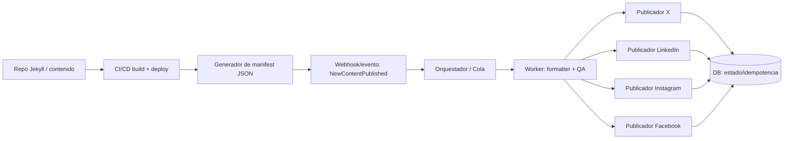
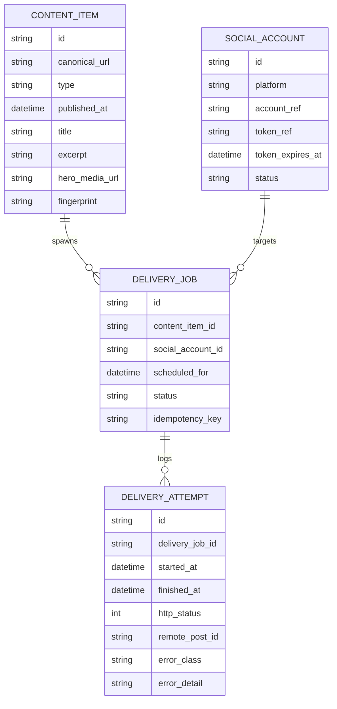

# Viabilidad de desarrollar una herramienta propia para anunciar automáticamente contenido de un blog en Jekyll en X, LinkedIn, Instagram y Facebook

## Resumen ejecutivo

La construcción de una herramienta propia que detecte nuevas publicaciones generadas en tu blog (Jekyll) y las anuncie automáticamente en X, LinkedIn, Instagram y Facebook es **técnicamente viable** para tu volumen objetivo (≈2 entradas diarias y 20–30 noticias semanales) siempre que se diseñe como un sistema **event‑driven**, con **idempotencia**, **cola de trabajos**, **programación**, y **controles anti‑spam/anti‑duplicados**. La carga transaccional esperada es baja a moderada (cientos a ~1.000 publicaciones/mes sumando todas las redes), por lo que **serverless** y colas gestionadas son un encaje natural y barato. citeturn28view0turn16search14turn2search1turn6search13

Los **principales riesgos/limitantes no son de infraestructura**, sino de **acceso y cumplimiento**:  
- **Meta (Instagram/Facebook)**: para publicar en nombre de cuentas/páginas fuera del equipo del app suele requerirse **App Review** y, según permisos/casos, **Business Verification**; además hay particularidades como Page Publishing Authorization y requisitos estrictos de “media URL pública” para Instagram. citeturn30search0turn30search1turn30search6turn25search0  
- **LinkedIn**: el ecosistema de permisos tiene fricción; la API moderna de “Posts” es versionada y requiere cabeceras específicas, y ciertos permisos de lectura son restringidos. Para publicar orgánico, suele bastar con `w_member_social` (usuario) o `w_organization_social` (organización) en el contexto adecuado. citeturn12view2turn3view6turn11view5  
- **X**: la escritura por API es posible y bien documentada, pero el modelo actual es **pay‑per‑usage** con precios por endpoint visibles en el Developer Console; además hay reglas explícitas contra automatización spam/duplicativa. citeturn26view4turn9search6turn26view6turn26view7

Recomendación final (técnica y operativa):  
- **Sí es viable** construir una herramienta propia si tu objetivo incluye: personalización por red, integración estrecha con agentes generativos, control de calidad, trazabilidad, y posibilidad de crecer a formatos más complejos (documentos, vídeos, campañas por tipo de contenido).  
- Si el objetivo es “anunciar enlaces” con mínima ingeniería y mínima carga de compliance, herramientas como Hootsuite/Buffer/Zapier/n8n pueden resolver gran parte del flujo; el criterio de decisión debería ser **control + auditoría + coste de mantenimiento vs. velocidad de puesta en marcha**. citeturn20view2turn18search1turn29view1turn21search0

## Revisión de APIs oficiales y requisitos por plataforma

A continuación se resumen **endpoints de publicación**, **autenticación**, **permisos**, **límites de tasa**, y **políticas de automatización** más relevantes, priorizando documentación oficial.

### X (publicación, autenticación, límites y políticas)

**Endpoint principal de publicación**: `POST /2/tweets` (“Create or Edit Post”). citeturn26view0turn28view0  
- El payload admite `text` y, si corresponde, `media.media_ids` (tras subir media). citeturn27view1turn26view1  
- La documentación explicita que el endpoint requiere token OAuth 2.0 user‑context (y lista campos como `quote_tweet_id`, `reply`, `poll`, etc.). citeturn27view1turn3view7  

**Autenticación**: OAuth 2.0 Authorization Code Flow con PKCE es el flujo recomendado para actuar en nombre de usuario. citeturn1search1turn26view2  
- La propia guía de OAuth 2.0 describe emisión/uso de tokens y contempla refresh token vía `POST /2/oauth2/token` (grant tipo refresh). citeturn10search18turn26view2  

**Media**:  
- Subida de media vía endpoints v2 (`POST /2/media/upload`) y flujo chunked (INIT/APPEND/FINALIZE/STATUS) para vídeo/archivos grandes. citeturn10search6turn10search1  
- Especificaciones (ejemplo oficial): JPG/PNG/GIF/WEBP; imágenes ≤5 MB; GIF animado ≤15 MB; y advertencia de límites específicos por `media_category`. citeturn17search0  

**Rate limits** (por endpoint):  
- `POST /2/tweets`: 10.000/24h por app y 100/15 min por usuario (según tabla oficial). citeturn28view0  
- `POST /2/media/upload`: 50.000/24h por app y 500/15 min por usuario (tabla oficial). citeturn28view0  
- El propio documento explica el uso de cabeceras `x-rate-limit-*` y la distinción per-app/per-user. citeturn3view5  

**Modelo de costes**: X API usa **pay‑per‑usage** (créditos) sin suscripción, con precios por endpoint consultables en Developer Console. También se indica deduplicación de cobro para el mismo recurso en 24 horas en el contexto de billing. citeturn9search0turn9search6turn9search2  

**Políticas/automatización**:  
- Reglas oficiales de automatización (Help Center): se recuerda que actividad automatizada que viole reglas puede implicar filtrado/suspensión, y se advierte explícitamente sobre contenido “duplicative” o “spammy”. citeturn26view6turn14search2turn14search27  
- La política de “Authenticity” prohíbe “content spam” (bulk/duplicative/irrelevant/unsolicited). citeturn26view7  

Implicación práctica para tu caso: con ~decenas de posts/semana estás muy por debajo de límites técnicos, pero el **riesgo real** está en publicar textos demasiado similares (misma plantilla, mismos hashtags, mismo enlace repetido) y/o en automatizar menciones/hashtags de forma agresiva. citeturn26view6turn26view7  

### LinkedIn (Posts API vs UGC, autenticación, permisos y límites)

**Evolución de endpoints (clave para viabilidad a medio plazo)**:  
- La documentación de “Posts API” indica que **Posts API reemplaza ugcPosts** y requiere cabeceras `Linkedin-Version` (YYYYMM) y `X-Restli-Protocol-Version: 2.0.0`. citeturn11view0turn12view2  
- En Posts API aparecen ejemplos con `POST https://api.linkedin.com/rest/posts`. citeturn12view2  
- Paralelamente, “Share on LinkedIn” (self‑serve) sigue documentando `POST https://api.linkedin.com/v2/ugcPosts` para crear shares y exige `X-Restli-Protocol-Version: 2.0.0`. citeturn3view6turn2search1  

**Autenticación**: LinkedIn usa OAuth 2.0; documenta flujos 3‑legged (member) y 2‑legged (application) y la exigencia de TLS moderno. citeturn11view2turn1search6  

**Permisos relevantes para publicar** (según Posts API):  
- `w_member_social`: publicar en nombre de un miembro autenticado. citeturn12view2turn3view6  
- `w_organization_social`: publicar/comentar/reaccionar en nombre de una organización, restringido a roles de administrador/DSC poster/content admin (y variantes según doc). citeturn12view2turn13search9  
- `r_member_social` está documentado como **restringido** (aprobación). citeturn13search7  

**Acceso/approval**: la guía “Getting Access to LinkedIn APIs” (versión en español) aclara que **la mayoría de permisos y partner programs requieren aprobación explícita**; las “Open Permissions” son la excepción. citeturn11view5turn13search10  

**Media (imágenes, vídeo, documentos)**:  
- Posts API señala que adjuntar imagen/vídeo/documento requiere subir primero el asset para obtener un URN (`urn:li:image`, `urn:li:video`, `urn:li:document`). citeturn12view2turn13search17  
- Posts API indica explícitamente que no soporta “URL scraping” para artículos porque introduce imprevisibilidad: hay que declarar título/thumbnail/description al crear el post y, si se quiere thumbnail, subir imagen por API de imágenes. citeturn12view2  
- La documentación histórica del Assets API existe pero advierte de reemplazos (Images API / Videos API). citeturn11view1  

**Rate limiting**:  
- El documento oficial de rate limits explica límites diarios por aplicación y por miembro, reseteo a medianoche UTC y 429 en rate limit. También afirma que los límites estándar **no se publican** y deben consultarse en el Developer Portal/Analytics para endpoints usados. citeturn11view3turn2search0turn2search6  
- Términos de uso de la API incluyen referencias a no exceder límites aplicables y mencionan un umbral de 100.000 llamadas diarias “absent any use-quota restrictions” (en contexto contractual). citeturn2search11turn11view4  

Implicación práctica: para tu caso la publicación orgánica suele ser viable con `w_member_social`/`w_organization_social` pero el proyecto debe asumir que **LinkedIn cambia versiones/cabeceras** y que el control del límite real se hace en portal (no una tabla fija por endpoint). citeturn12view2turn2search0  

### Instagram (Instagram Platform / Graph, publicación, límites y media)

**Modelo de publicación**: la guía oficial de Content Publishing describe parámetros como `image_url`/`video_url` y explicita que **Meta hará cURL del recurso**, por lo que debe estar en un **servidor público**. citeturn25search0  
- La referencia de IG User Media (también en español) menciona la creación de contenedores con `POST /<IG_USER_ID>/media` y parámetros como `image_url`. citeturn25search1turn25search5  

**Requisitos de cuenta**: la visión general de Instagram Platform indica que la API se orienta a **cuentas profesionales (Business/Creator)** vinculadas a una Page cuando se implementa Facebook Login for Business (dependiendo del setup). citeturn6search5turn6search10  

**Permisos / tareas de Page**: la referencia de IG User Media indica que el usuario de tu app debe poder realizar tareas tipo MANAGE o CREATE_CONTENT sobre la Page enlazada a la cuenta profesional para operar. citeturn6search1  

**Límites de publicación (rate)**: el documento oficial de Content Publishing establece un límite de **100 publicaciones vía API en un período móvil de 24 horas** (carousels cuentan como una publicación). citeturn16search14turn0search2  
- Existe un endpoint “IG User Content Publishing Limit” para consultar uso del límite, según referencia oficial. citeturn2search4turn2search8  

**Límites y formatos de contenido**:  
- En IG User Media aparecen límites de caption: **máximo 2200 caracteres**, hasta 30 hashtags y 20 @tags, según snippet de referencia. citeturn16search2  
- La guía de Content Publishing documenta limitaciones como “JPEG es el único formato soportado” en el contexto de publicación. citeturn17search1turn16search14  
- La referencia de IG User Media muestra especificaciones de imagen (formato JPEG, tamaño máximo 8MB, ratios permitidos 4:5 a 1.91:1, etc.). citeturn17search4turn16search2  

Implicación práctica: Instagram hace que el “anuncio de un post” sea un problema **multimedia** (no basta con texto+link como en otras redes). Para que sea operativo, tu herramienta debe generar/seleccionar automáticamente una imagen (o vídeo) por contenido y asegurar hosting público directo. citeturn25search0turn17search4  

### Facebook (Pages API / Graph, publicación, permisos, rate y particularidades)

**Publicación típica en Pages**: la guía “Getting Started” de Pages API describe crear post haciendo `POST /{page-id}/feed` con parámetro `message`. citeturn6search13  
- Para obtener Page access token, la guía oficial de tokens explica el flujo: primero user access token, luego usarlo para obtener page access token por Graph API. citeturn6search20  

**Permisos y tokens**: la referencia de “Post” menciona explícitamente uso de Page access token con permisos como `pages_manage_posts` para operaciones de publicación/lectura (según el caso). citeturn6search19turn0search3  

**Rate limiting**: la visión general oficial de rate limiting de Graph API describe el modelo de límites por app y usuario, y da ejemplos de umbrales (p.ej., >200 llamadas/hora por usuario si el total del app lo permite). citeturn2search3turn0search7  

**Multimedia y scheduling (punto crítico)**: en la referencia de Page Photos se documenta que puedes publicar una foto ya alojada usando el parámetro `url`, y además se indica una restricción relevante: “`published` must be false, and you can't set `scheduled_publish_time`” en ese modo, lo que impacta cómo diseñar la programación de posts con imagen si dependes de URLs externas. citeturn25search6turn17search20  

Implicación práctica: para posts con imagen y programación, conviene diseñar el sistema para (a) mantener un almacén propio de medios y (b) elegir cuidadosamente el método de subida (URL vs binario) según lo que permita la API en el modo de scheduling. citeturn25search6turn6search13  

## Opciones de arquitectura e integración con Jekyll

Con tus volúmenes, la arquitectura debe optimizar: **fiabilidad**, **idempotencia**, **programación** y **cumplimiento** (evitar duplicados/spam), más que throughput puro.

### Patrones recomendados

**Evento desde CI/CD (preferido)**  
1) El agente genera `.md` (front matter + contenido) en el repo.  
2) El pipeline de build/deploy de Jekyll genera un “manifest de publicado” (JSON) y lo publica junto al sitio.  
3) Un “publisher service” detecta nuevos ítems y encola trabajos por red social.  

Ventaja: no dependes de polling/RSS; cada publicación real dispara exactamente un evento. Riesgo: si el pipeline reintenta builds, necesitas idempotencia fuerte.

**Polling RSS/Atom (alternativa simple)**  
Un job cada N minutos compara el feed RSS/Atom del blog y encola novedades. Ventaja: desacopla del repo/CI. Riesgo: duplicados si el feed re-ordena o si hay actualizaciones; requiere heurística.  

**Híbrido**  
Evento desde CI para “posts largos/manuales” y polling para “noticias” si se publican desde otra fuente.

### Propuesta de arquitectura operativa (event‑driven + cola + workers)



**Justificación técnica**: tus volúmenes quedan muy por debajo de límites típicos de posting en X (100/15 min por usuario para `POST /2/tweets`) y de publicación en Instagram (100 API‑published posts/24h por cuenta), por lo que un diseño con cola se centra en retries y orden (no en capacidad). citeturn28view0turn16search14  

### Modelo de datos mínimo para idempotencia, programación y auditoría



**Notas de diseño**:  
- `fingerprint` e `idempotency_key` evitan duplicados accidentales por re‑ejecución del pipeline o reintentos.  
- `remote_post_id` permite correlacionar y (cuando la red lo soporte) borrar/editar. (X soporta delete por id; LinkedIn y Meta tienen endpoints de gestión con permisos adecuados). citeturn10search15turn12view2turn6search0  

## Integración con agentes generadores de contenido y control de calidad

Para un sistema con generación automática y alta cadencia, la viabilidad depende de imponer un **contrato de salida** (formatos/metadata) y un **pipeline de QA** que reduzca riesgos de duplicación y de incumplimiento de políticas.

### Contrato de “paquete de publicación” recomendado

**Entrada única (canonical) por contenido**: el agente y/o el pipeline de Jekyll deben producir un objeto normalizado (ejemplo conceptual):

- `canonical_url` (URL pública final del post)
- `title`, `excerpt`, `tags`
- `content_type`: {news, post, workshop, manual}
- `hero_media`: {type, url, alt_text}
- `social_templates`: opcional, por red (“copy base”, hashtags sugeridos, CTA)
- `safety_flags`: {needs_review, sensitive_topic, medical_legal, etc.}

Esto permite que el “publisher” sea determinista y auditable, y que puedas incluir una “aprobación humana” sólo cuando `needs_review=true`.

### Control de calidad orientado a evitar sanciones por spam/duplicados

**Riesgo distintivo**: X es explícito respecto a “bulk/duplicative” y automatización spam; por tanto, aunque la herramienta sea técnicamente correcta, puede fallar operativamente si publica demasiado “igual” o con patrones repetitivos. citeturn26view6turn26view7  

Controles recomendados (con ejecución automática antes de poner en cola):  
- **Detección de duplicados semánticos**: comparar el borrador de copy con el histórico por plataforma (ventana 7–30 días) para minimizar “substantially similar content”. (Implementable con embeddings o SimHash; la política relevante es el criterio, no la técnica). citeturn26view6turn26view7  
- **Normalización por red**: no reutilizar exactamente el mismo texto entre redes; introducir variaciones controladas (distinto hook, distinto CTA). Esto reduce señales de “bulk posting” también en entornos Meta donde se reportan restricciones por posting masivo. citeturn14search1turn26view7  
- **Límites de longitud**:  
  - X: 280 caracteres con reglas de cómputo especiales; hay doc específica de conteo. citeturn16search0turn26view3  
  - LinkedIn: límite de 3000 caracteres por post (Help Center). citeturn16search1  
  - Instagram: 2200 caracteres de caption; límites de hashtags/@tags documentados. citeturn16search2  

### Programación (“scheduling”) y cadencias

A tu ritmo de publicación, lo más eficaz suele ser:  
- ventana de publicación por red (p.ej. 2–4 slots diarios) y colas por prioridad (noticia vs post largo),  
- backoff con jitter ante 429 o errores temporales,  
- y reintentos limitados con escalado a “revisión humana” si el error es de permisos/política. (LinkedIn y Meta devuelven 429 en rate limit; X también). citeturn11view3turn3view5  

## Manejo de multimedia y hosting

La capa multimedia es el mayor diferenciador entre “anunciar enlaces” y “publicar correctamente” en todas las redes.

### Reglas prácticas por plataforma

**Instagram (imprescindible)**  
- Si usas `image_url`/`video_url`, Meta hará cURL del archivo y exige que esté accesible en un servidor público. En la práctica: URL directa, sin auth, sin redirecciones frágiles, con MIME correcto. citeturn25search0turn25search5  
- Especificaciones de imagen (referencia IG User Media): JPEG, hasta 8MB, aspect ratio entre 4:5 y 1.91:1. citeturn17search4  
- Límite de publicación: 100 posts vía API por 24h; consulta disponible por endpoint de “content publishing limit”. citeturn16search14turn2search4  

**X**  
- Subida de media v2 y chunked upload para grandes; specs de imagen oficiales: JPG/PNG/GIF/WEBP, imagen ≤5MB, GIF animado ≤15MB. citeturn10search1turn17search0  

**LinkedIn**  
- Posts API indica que para adjuntar image/video/document hay que subir el media asset y referenciarlo por URN; además prohíbe URL scraping automático para artículos (hay que setear thumbnail/title/description). citeturn12view2turn13search17  

**Facebook Pages**  
- Para fotos ya alojadas, la API permite `url` en Page Photos, pero documenta restricciones con `published` y `scheduled_publish_time` que conviene tratar como “diseño por método”: si necesitas programación, revisa qué método soporta scheduling en tu caso. citeturn25search6turn6search13  

### Estrategia recomendada de generación/hosting de medios

Dado que en Instagram necesitas imagen/vídeo para que el anuncio tenga sentido, una estrategia estable es:

- **Generar una imagen “card” automática** por contenido (plantilla con título, subtítulo, marca, fecha), además de un thumbnail Open Graph para el blog.  
- **Publicar medios en tu propio dominio/CDN** (misma infraestructura del blog o bucket estático) con URLs permanentes y cacheables.  
- Mantener un “media registry” por `content_item_id` para no regenerar de forma no determinista (evita cambios que disparen re‑publicaciones).  

Esta estrategia reduce fallos por accesibilidad de URL (Instagram), evita depender de terceros para hosting, y facilita auditoría.

## Seguridad, gestión de credenciales, cumplimiento legal y políticas

### Gestión de credenciales y rotación

**X**  
- OAuth 2.0 con PKCE (user‑context) y posibilidad de refresh token (`POST /2/oauth2/token`) según documentación. Esto favorece rotación sin intervención manual frecuente. citeturn26view2turn10search18  

**LinkedIn**  
- OAuth 2.0 (member authorization 3‑legged) es el patrón estándar; el acceso a `w_member_social` se asocia al producto “Share on LinkedIn” en el Developer Portal. citeturn11view2turn3view6  

**Meta (Instagram/Facebook)**  
- La referencia de permisos y App Review indica que para ciertos accesos a datos/funcionalidades se exige App Review y puede requerirse Business Verification; y existe documentación de App Modes (Standard vs Advanced Access) y App Review específico de Instagram Platform. citeturn30search0turn30search1turn30search6turn30search15  

**Almacenamiento seguro**  
Opciones típicas:  
- secretos en CI (útil en MVP, pero con rotación manual): GitHub Actions Secrets documenta cómo almacenar y controlar acceso; GitHub cifra secretos con mecanismos documentados. citeturn24search3turn24search15  
- secret managers gestionados para producción:  
  - AWS Secrets Manager: $0.40 por secreto/mes (más llamadas). citeturn24search0  
  - Google Secret Manager: cobra por versiones activas y operaciones; precios publicados por Google Cloud. citeturn24search5turn24search1  
  - Cloudflare Workers: documentación de “secrets” como variables cuyo valor no se vuelve a mostrar tras definirse. citeturn24search6turn24search2  

Recomendación: en MVP, secretos en CI + rotación manual; en producción, mover tokens/refresh tokens a un secret manager y automatizar rotación (especialmente si integras más de una cuenta por red).

### Cumplimiento legal (UE/España) y obligaciones de transparencia

Aunque tu herramienta sea “solo” un publicador, normalmente tratará: tokens OAuth, IDs de cuentas, logs de actividad y potencialmente datos personales si guardas info de administradores o métricas. Bajo GDPR y normativa española:  
- GDPR (Reglamento (UE) 2016/679) aplica al tratamiento de datos personales. citeturn15search0  
- En España, la Ley Orgánica 3/2018 (LOPDGDD) complementa el marco. citeturn15search1  
- Si incluyes notificaciones por email/trackers/cookies en dashboards internos, entra también el marco de privacidad en comunicaciones electrónicas (Directiva 2002/58/CE). citeturn15search2  

Implicaciones operativas: política de privacidad para la herramienta (si hay usuarios), minimización y retención de logs, control de accesos, y documentación sobre dónde se almacenan tokens y con qué finalidad.

### Cumplimiento con políticas por red (automatización, spam, atribución)

- **X**: reglas de automatización y autenticidad prohíben contenido duplicativo/bulk/irrelevante y advierten de enforcement (incluida suspensión). citeturn26view6turn26view7  
- **LinkedIn**: API Terms of Use fijan obligaciones contractuales, entre ellas respetar límites y no intentar excederlos. citeturn11view4turn2search11  
- **Meta**: Platform Terms y Developer Policies contemplan enforcement (suspensión/eliminación de apps) y hay estándares de “Spam” en Community Standards. citeturn14search0turn14search11turn14search8  
- Meta ha publicado actualizaciones de Platform Terms/Developer Policies que incluyen claridad sobre requisitos de privacidad (p.ej., accesibilidad de la política por crawlers). citeturn14search15  

Implicación práctica: tu herramienta debe incluir (1) control anti‑duplicados, (2) límites internos por cuenta/red, (3) trazabilidad de quién autorizó qué, y (4) opción de “human review” en contenidos sensibles.

## Escalabilidad, costes, alternativas, plan MVP, pruebas, riesgos y decisión final de viabilidad

### Escalabilidad esperada

Con ~140–180 piezas/mes y hasta 4 redes, el orden de magnitud (si anuncias todo en todas las redes) es ~560–720 publicaciones/mes. Esto está **por debajo** de límites de posting en X (100/15 min por usuario para `POST /2/tweets`) y de Instagram (100/24h por cuenta) si distribuyes en el día. citeturn28view0turn16search14  
La escalabilidad real dependerá más de:  
- número de cuentas gestionadas,  
- volumen de media (vídeo) y fallos por accesibilidad de `image_url`,  
- y cambios de permisos/versiones de APIs (LinkedIn version header, Meta app review, etc.). citeturn12view2turn30search6turn25search0  

### Estimación de costes mensuales (infra + tooling)

**Supuestos** (para una estimación razonable):  
- 720 “publicaciones finales”/mes (todas las redes).  
- 2–4 llamadas API por publicación según media (p.ej., Instagram: container + publish; X: upload + tweet; LinkedIn: upload asset + post).  
- 5.000–20.000 ejecuciones/mes para workers/orquestación (incluyendo reintentos).  

**Infra serverless (ejemplos)**

| Opción | Componentes típicos | Coste marginal con tu volumen | Notas |
|---|---|---:|---|
| entity["company","Amazon Web Services","cloud provider"] serverless | Lambda + SQS + EventBridge + DynamoDB + Secrets Manager | Bajo; Secrets Manager tiende a dominar si guardas varios secretos | Lambda: $0.20 / 1M requests (más free tier). SQS y EventBridge tienen free tiers y precios por millón. DynamoDB on‑demand cobra por millón de lecturas/escrituras. Secrets Manager: $0.40/secret/mes. citeturn22search0turn22search1turn22search2turn22search3turn24search0 |
| entity["company","Google Cloud","cloud platform"] serverless | Cloud Run + Pub/Sub + Cloud Scheduler + Firestore + Secret Manager | Frecuentemente ~$0 con free tier en cargas pequeñas | Cloud Run incluye 2M requests/mes free tier y cuotas de CPU/RAM. Secret Manager cobra por versión y operaciones. citeturn23search3turn24search5turn24search1 |
| entity["company","Cloudflare","internet infrastructure company"] serverless | Workers + Queues + KV/D1/R2 | Desde $5/mes en plan paid en muchos casos | Workers paid incluye 10M requests/mes; Queues cobra por operaciones ($0.40/millón tras incluido) y documenta fórmula de 3 ops por mensaje. citeturn23search4turn23search0turn23search17 |

**Coste CI/CD (si usas GitHub Actions en repo privado)**  
Se anunció un cambio de pricing con cargo “cloud platform” de $0.002/minuto en escenarios aplicables desde 2026 (según recursos oficiales de GitHub). En repos públicos puede no aplicar, pero conviene contabilizarlo si tu repo es privado. citeturn23search5turn23search2  

**Costes de APIs de redes**  
- X: pay‑per‑usage con créditos; los precios por endpoint se consultan en consola (no siempre públicos en la doc). Para tu caso, el coste depende de cuánto leas datos (reads) y de si el modelo factura ciertos writes; la documentación oficial enfatiza el modelo credit‑based y tracking en consola. citeturn9search0turn9search6turn9search2  
- LinkedIn/Meta: típicamente no cobran “por llamada” al estilo cloud, pero el coste real se traslada a compliance (app review, verificación, mantenimiento de versiones). citeturn11view5turn30search0  

### Alternativas existentes (SaaS y open‑source) y comparativa

| Alternativa | Qué resuelve bien | Limitaciones típicas para tu caso | Coste (orientativo / publicado) |
|---|---|---:|---:|
| Hootsuite | Calendario multi‑red, programación “unlimited posts”, workflows de equipo | Precios no siempre visibles en HTML; puede ser sobredimensionado si quieres integración “tight” con agentes | Página de planes describe Standard/Advanced/Enterprise, programación ilimitada y capacidades; precio puede requerir UI interactiva. citeturn20view4turn19view2 |
| Buffer | Muy rápido para programar; modelo por “channel”; colas grandes en planes de pago | En plan Free hay límite de posts en cola; automatización avanzada suele requerir integraciones externas | Pricing publicado: Essentials $5/mes por 1 channel; límite de cola Free: 10 por canal (doc soporte). citeturn18search1turn18search9 |
| Zapier | Conecta RSS/CI con APIs; buen para MVP sin infraestructura propia; observabilidad aceptable | Coste crece por “tasks”; algunos conectores limitan acciones avanzadas (especialmente Meta/LinkedIn) | Pricing publicado: Professional “starting from” $19.99/mes billed annually; Free 100 tasks. citeturn29view1turn19view5 |
| IFTTT | Muy sencillo; webhooks; útil para automatizaciones pequeñas | Cobertura desigual por red (depende de “applets” disponibles); menos control de QA y trazabilidad | Planes publicados: $0 (2 applets), $2.99/mes (20), $8.99/mes (unlimited). citeturn19view6 |
| n8n (cloud o self‑host) | Orquestación potente; conectores; buen “centro” para flujos con aprobación | Requiere operar/monitorizar si self‑host; algunos conectores pueden romperse con cambios de API | Pricing oficial cloud basado en ejecuciones; self‑host reduce coste pero aumenta ops. citeturn21search0turn21search2 |
| Node‑RED / Huginn (self‑host) | Control total; orientado a flujos/eventos; extensible por nodes/agentes | Mucho “ops” y mantenimiento; conectores oficiales a redes cambian | Node‑RED es proyecto OpenJS; Huginn se describe como “hackable IFTTT” y event graph. citeturn21search3turn21search2turn21search11turn21search1 |

Nota: en tu caso, las alternativas suelen fallar en la parte “premium” del problema: **control por red, QA anti‑duplicados, generación automática de media, trazabilidad e idempotencia**. Ahí una herramienta propia (o un híbrido con n8n + microservicio) aporta valor diferencial.

### Plan de implementación MVP (mínimo viable) y roadmap

**MVP recomendado (en 2–4 semanas de trabajo efectivo, según experiencia y acceso a permisos)**  
Objetivo: “publicar anuncios confiables” con auditoría básica, sin optimizar analytics.

1) **Esquema de metadatos en Jekyll**: front matter estándar (`title`, `date`, `summary`, `image`, `content_type`, `social: {tags, angle}`), y generación de un `manifest.json` en build.  
2) **Detección de nuevos contenidos**: job en CI que compara `manifest.json` actual vs anterior y emite eventos “NewContentPublished”.  
3) **Base de datos de estado**: tabla/colección para idempotencia y auditoría (como el ER anterior).  
4) **Conectores iniciales**:  
   - LinkedIn: publicar texto+enlace (article post) usando Posts API `rest/posts` y cabeceras versionadas; subir thumbnail si se quiere control visual. citeturn12view2  
   - Facebook Page: publicar a `/page-id/feed` (texto/enlace); añadir foto en una segunda iteración tras validar estrategia de scheduling con foto. citeturn6search13turn25search6  
   - X: `POST /2/tweets` (texto+enlace) y luego media si aplica. citeturn28view0turn27view1  
   - Instagram: publicar imagen “card” + caption + link (en bio o shortlink) mediante `image_url` público y contenedor. citeturn25search0turn25search1  
5) **QA mínimo**:  
   - validador de longitud (X/LinkedIn/Instagram),  
   - bloqueo de duplicados “exactos” por hash,  
   - revisión manual opcional si `content_type=workshop/manual` o si el agente marca `needs_review`. citeturn16search0turn16search1turn16search2  

**Roadmap (iteraciones de madurez)**  
- Programación por “ventanas” y colas por prioridad; distribución por timezone; backoff con jitter. citeturn11view3turn3view5  
- Control avanzado de duplicidad semántica (embeddings) y biblioteca de variantes por red (reduce riesgo de “bulk/duplicative”). citeturn26view7turn26view6  
- Flujos de aprobación (estado “pending_approval”), y panel de auditoría.  
- Publicación de documentos LinkedIn (manuales PDF) vía Documents API + Posts API. citeturn13search17turn12view2  
- Observabilidad: métricas por red, alertas de permisos expirados, ratio de fallos por endpoint.  

### Checklist de pruebas (enfocado a publicar “sin sorpresas”)

- **Idempotencia**: re‑ejecutar el mismo build 3 veces no debe publicar 3 veces; validar por `idempotency_key`.  
- **Errores 401/403**: token caducado/permisos insuficientes → debe degradar a “needs_attention” sin reintentos infinitos.  
- **Errores 429**: aplicar backoff y reintentar dentro de ventana; registrar cabeceras de rate limit cuando existan (X documenta `x-rate-limit-*`). citeturn3view5turn11view3  
- **Multimedia**:  
  - Instagram: URL pública realmente accesible (curl desde Internet), MIME correcto, tamaño y ratio dentro de specs. citeturn25search0turn17search4  
  - X: imágenes ≤5MB y formatos soportados. citeturn17search0  
- **Controles anti‑spam**: publicar 10 anuncios de prueba con copy variado; comprobar que no dispara flags internos y que el copy no es “duplicative/bulk”. citeturn26view7turn14search8  
- **Versionado LinkedIn**: cambiar `Linkedin-Version` a una versión vigente y validar compatibilidad. citeturn12view2  

### Riesgos principales y mitigaciones

| Riesgo | Dónde aparece | Impacto | Mitigación práctica |
|---|---|---:|---|
| Permisos/App Review bloquean el go‑live | Meta (Instagram/Facebook) | Alto | Diseñar MVP para operar primero con cuentas propias (role users), preparar screencasts y use‑case claro para App Review; planificar Business Verification si aplica. citeturn30search0turn30search1turn30search6 |
| Publicación Instagram falla por URL/media | Instagram | Alto | Hosting propio/CDN, URLs directas sin auth; validación “preflight curl” antes de crear contenedor. citeturn25search0turn17search4 |
| Sanciones por automatización duplicativa | X y Meta | Alto | Variación sistemática de copy, deduplicación semántica, rate limiting interno, y “circuit breaker” si se detecta patrón repetitivo. citeturn26view6turn26view7turn14search8 |
| Cambios de API/versiones rompen integración | LinkedIn y X (y Meta) | Medio‑Alto | Encapsular conectores; pruebas contractuales; monitorear changelogs; uso de cabeceras versionadas en LinkedIn. citeturn12view2turn8view1 |
| Coste/visibilidad de pricing de X | X | Medio | Minimizar lecturas; medir consumo en consola; presupuestar “buffer” de créditos y alertas de gasto. citeturn9search6turn9search2 |

### Ejemplos de payloads y pseudocódigo (publicar desde Jekyll/CI)

**Ejemplo: manifest generado en build (conceptual)**

```json
{
  "generated_at": "2026-03-07T10:15:00Z",
  "items": [
    {
      "id": "2026-03-07-nueva-noticia",
      "canonical_url": "https://tu-dominio.com/noticias/2026/03/07/nueva-noticia.html",
      "title": "Nueva noticia",
      "excerpt": "Resumen corto…",
      "content_type": "news",
      "hero_image_url": "https://tu-dominio.com/assets/cards/2026-03-07-nueva-noticia.jpg",
      "published_at": "2026-03-07T09:55:00Z"
    }
  ]
}
```

**GitHub Actions (idea de flujo)**  
(Nota: el coste de Actions puede cambiar según repo y modelo de pricing; GitHub ha anunciado cargos por minuto en ciertos escenarios). citeturn23search5turn23search2  

```yaml
name: build-and-announce
on:
  push:
    branches: [ main ]

jobs:
  build:
    runs-on: ubuntu-latest
    steps:
      - uses: actions/checkout@v4
      - name: Build Jekyll
        run: bundle exec jekyll build
      - name: Generate manifest
        run: node scripts/build-manifest.js
      - name: Deploy site
        run: ./scripts/deploy.sh

  announce:
    needs: build
    runs-on: ubuntu-latest
    steps:
      - uses: actions/checkout@v4
      - name: Detect new content & enqueue jobs
        env:
          PUBLISHER_ENDPOINT: ${{ secrets.PUBLISHER_ENDPOINT }}
          PUBLISHER_TOKEN: ${{ secrets.PUBLISHER_TOKEN }}
        run: node scripts/enqueue-new-content.js
```

**Publicación en X (pseudocódigo)**  
La API oficial define `POST /2/tweets` y el campo `text`; el endpoint tiene rate limit publicado. citeturn27view1turn28view0  

```python
def post_to_x(access_token: str, text: str, media_ids: list[str] = None):
    url = "https://api.x.com/2/tweets"
    body = {"text": text}
    if media_ids:
        body["media"] = {"media_ids": media_ids}

    # http_post(url, headers={"Authorization": f"Bearer {access_token}"}, json=body)
    return {"status": "ok"}
```

**Publicación en LinkedIn (Posts API, conceptual)**  
Posts API requiere `Linkedin-Version` y `X-Restli-Protocol-Version`. citeturn12view2  

```javascript
async function postToLinkedIn({token, linkedinVersion, authorUrn, commentary, article}) {
  const url = "https://api.linkedin.com/rest/posts";
  const headers = {
    "Authorization": `Bearer ${token}`,
    "Linkedin-Version": linkedinVersion,            // YYYYMM
    "X-Restli-Protocol-Version": "2.0.0",
    "Content-Type": "application/json"
  };

  const body = {
    author: authorUrn,
    commentary,
    visibility: "PUBLIC",
    distribution: { feedDistribution: "MAIN_FEED", targetEntities: [], thirdPartyDistributionChannels: [] },
    lifecycleState: "PUBLISHED",
    content: article ? { article } : undefined
  };

  // httpPost(url, headers, body)
}
```

**Publicación en Instagram (conceptual)**  
La guía oficial indica `image_url`/`video_url` y que se hará cURL, por lo que debe ser público. citeturn25search0turn25search1  

```pseudo
function publishInstagramImage(igUserId, userAccessToken, imageUrlPublica, caption):
  # 1) crear contenedor
  containerId = POST "https://graph.facebook.com/vXX.X/{igUserId}/media"
                 with { image_url: imageUrlPublica, caption: caption, access_token: userAccessToken }

  # 2) publicar contenedor
  mediaId = POST "https://graph.facebook.com/vXX.X/{igUserId}/media_publish"
            with { creation_id: containerId, access_token: userAccessToken }

  return mediaId
```

**Publicación en Facebook Page feed (conceptual)**  
La guía de Pages API describe `POST /{page-id}/feed` con `message`. citeturn6search13turn6search20  

```pseudo
function publishFacebookPagePost(pageId, pageAccessToken, message, linkOptional):
  params = { message: message, access_token: pageAccessToken }
  if linkOptional: params.link = linkOptional

  POST "https://graph.facebook.com/vXX.X/{pageId}/feed" with params
```

### Fuentes clave (URLs) para consulta y seguimiento

```text
X API
- https://docs.x.com/x-api/posts/create-post
- https://docs.x.com/x-api/fundamentals/rate-limits
- https://docs.x.com/x-api/getting-started/pricing
- https://docs.x.com/fundamentals/authentication/oauth-2-0/overview
- https://help.x.com/en/rules-and-policies/x-automation

LinkedIn API
- https://learn.microsoft.com/en-us/linkedin/marketing/community-management/shares/posts-api
- https://learn.microsoft.com/en-us/linkedin/consumer/integrations/self-serve/share-on-linkedin
- https://learn.microsoft.com/en-us/linkedin/shared/authentication/authentication
- https://learn.microsoft.com/en-us/linkedin/shared/api-guide/concepts/rate-limits
- https://www.linkedin.com/legal/l/api-terms-of-use

Meta (Instagram/Facebook)
- https://developers.facebook.com/docs/instagram-platform/content-publishing/
- https://developers.facebook.com/docs/instagram-platform/instagram-graph-api/reference/ig-user/media
- https://developers.facebook.com/docs/pages-api/getting-started/
- https://developers.facebook.com/docs/facebook-login/guides/access-tokens/
- https://developers.facebook.com/docs/permissions/
- https://developers.facebook.com/docs/resp-plat-initiatives/individual-processes/app-review/
- https://developers.facebook.com/terms/dfc_platform_terms/
- https://developers.facebook.com/devpolicy/
- https://transparency.meta.com/policies/community-standards/spam/

Costes (ejemplos)
- https://aws.amazon.com/lambda/pricing/
- https://aws.amazon.com/sqs/pricing/
- https://aws.amazon.com/eventbridge/pricing/
- https://aws.amazon.com/secrets-manager/pricing/
- https://cloud.google.com/run/pricing
- https://developers.cloudflare.com/workers/platform/pricing/
- https://developers.cloudflare.com/queues/platform/pricing/

Legal (UE/España)
- https://eur-lex.europa.eu/eli/reg/2016/679/oj?locale=es
- https://www.boe.es/buscar/act.php?id=BOE-A-2018-16673
- https://eur-lex.europa.eu/legal-content/ES/ALL/?uri=CELEX:32002L0058
```

### Decisión final sobre viabilidad

**Viabilidad técnica**: alta. Los endpoints oficiales para publicar existen en las cuatro redes; X y LinkedIn ofrecen workflows claros para crear posts (X: `POST /2/tweets`; LinkedIn: `POST /rest/posts` con versionado), y Meta documenta el flujo de publicación en Instagram basado en contenedores y URLs públicas. Los límites de tasa relevantes para tu volumen no parecen un bloqueo. citeturn28view0turn12view2turn25search0turn16search14  

**Viabilidad operativa**: media‑alta, condicionada por compliance y acceso. El mayor riesgo es Meta App Review/Business Verification y la robustez multimedia (Instagram), más el control anti‑duplicados para cumplir reglas anti‑spam (especialmente X). citeturn30search0turn30search6turn26view7turn26view6  

**Recomendación**: construir una herramienta propia es recomendable si priorizas control, calidad y trazabilidad, y si asumes mantenimiento continuo de integraciones/permiso‑gobernanza. Para reducir tiempo a valor, una ruta híbrida (orquestación en n8n/Zapier + microservicio de publicación/QA + hosting propio de medios) suele optimizar esfuerzo sin renunciar al control esencial. citeturn21search0turn29view1turn25search0turn26view6